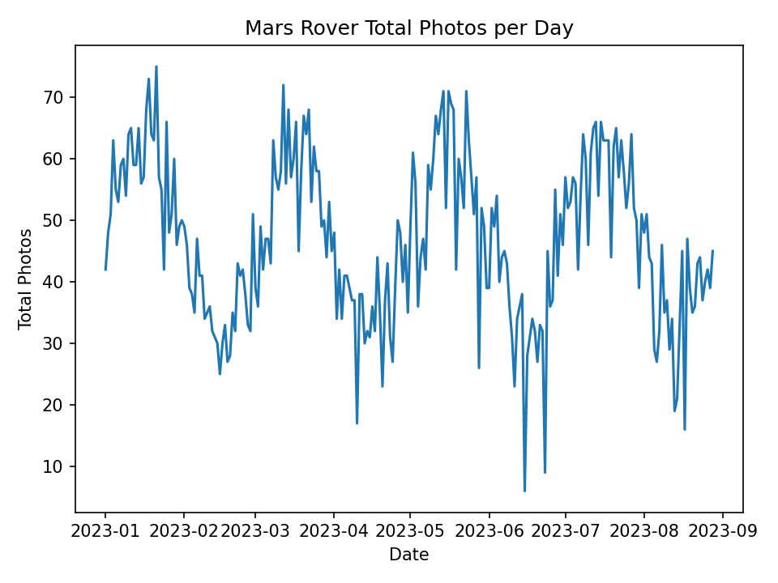
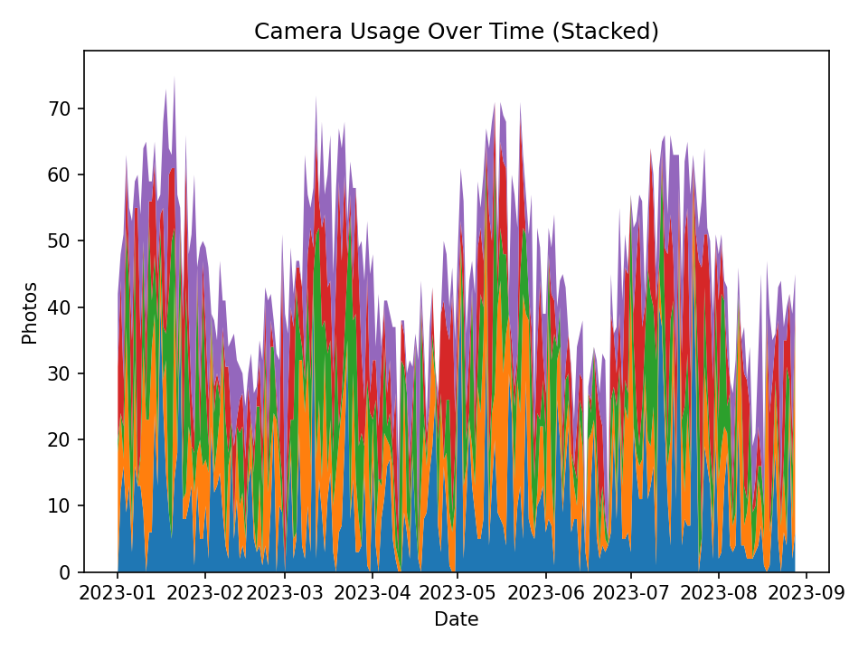

# 🚀 NASA Mars Rover Photo Analysis

This project demonstrates **data analysis, visualization, and machine learning** on Mars Rover photo activity.  
It’s based on an RIT group project — this repository contains **my portion** (data cleaning, visualization, and ML forecasting).  

---

## ✨ Highlights
- Analyzed **5,000+ Mars Rover photo records** (synthetic but realistic sample).
- Built **time-series visualizations** of rover camera usage.
- Implemented **ML models (Linear Regression, Random Forest)** to predict future activity.
- Produced **14-day forecasts** with rolling feature engineering.
- Organized into a modular, reproducible Python project.

---

## 📂 Project Structure
nasa-mars-rover-analysis/
├─ data/ # sample dataset (synthetic)
├─ results/ # generated plots, forecasts, metrics
├─ src/ # preprocessing, visualization, modeling modules
├─ main.py # end-to-end runner
├─ requirements.txt
├─ .gitignore
└─ README.md


---

## 📊 Example Outputs
Daily photo activity:  


Camera usage breakdown:  


Model evaluation (`results/model_scores.json`):  
```json
{
  "naive_mae": 6.9,
  "linear_regression_mae": 5.8,
  "random_forest_mae": 4.1
}
14-day forecast (results/forecast_14d.csv):

date	predicted_total_photos
2023-09-01	34.2
2023-09-02	29.8
…	…

🚀 Getting Started
1. Clone and Setup
bash

git clone https://github.com/<your-username>/nasa-mars-rover-analysis.git
cd nasa-mars-rover-analysis

# Create and activate venv
python -m venv .venv
.venv\Scripts\activate      # Windows
source .venv/bin/activate   # macOS/Linux

# Install dependencies
pip install -r requirements.txt
2. Run Analysis
bash

python main.py
Outputs will appear in results/:

daily_totals.png

camera_usage_stacked.png

model_scores.json

forecast_14d.csv

🛠 Tech Stack
Python 3.13

pandas, numpy

matplotlib

scikit-learn

👥 Collaboration Note
This repo reflects my portion of a larger group project.
Other teammates worked on different components not included here.